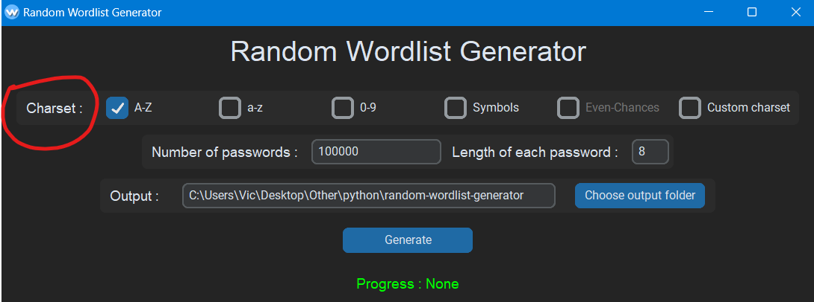
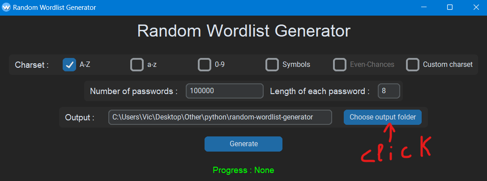
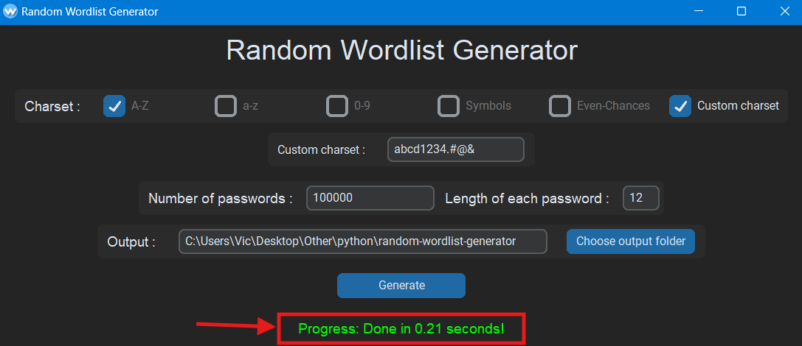

# Description

this is a desktop app that can be used to generate file with a list of passwords of random combinations or letters , numbers or symbols or any custom charset you choose with a specefic length for passwords.

# Usage

### 1. configure charset

make sure to choose the right charset for you

### 2. custom charset

you can set your own custom charset

### 3. length of passwords and amount of passwords

set the number of words to genrate and the length of each one

### 4. output

set the output folder by clicking the button or by manually typing it

### 5. progress

you'll see the progress status at the bottom and the work time of the generation

# Download

- ## windows
  [Wordlist generator.exe](https://www.mediafire.com/file/7nd1cik5mbzsl4p/RWG.zip/file)
- ## other
  if you have python installed install the required libraries and it should run by running main\.py script in the source code
